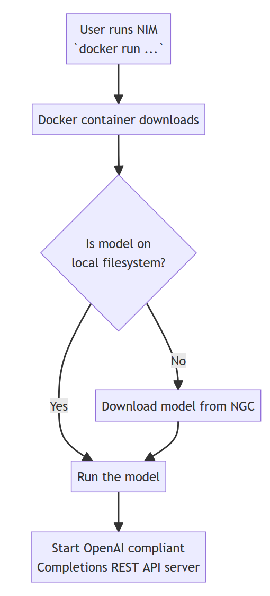
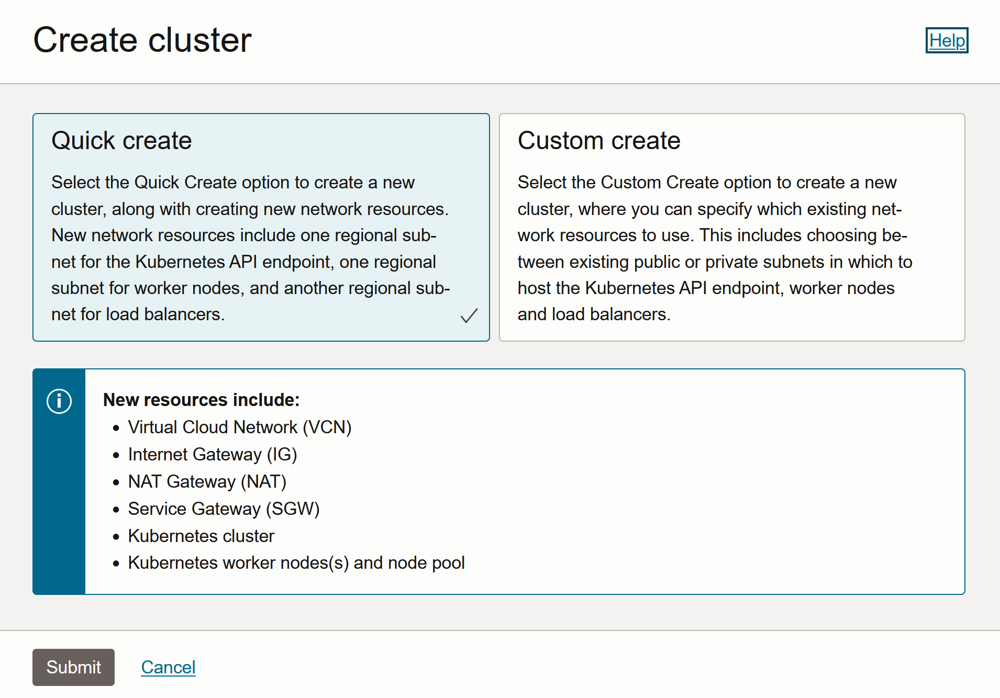
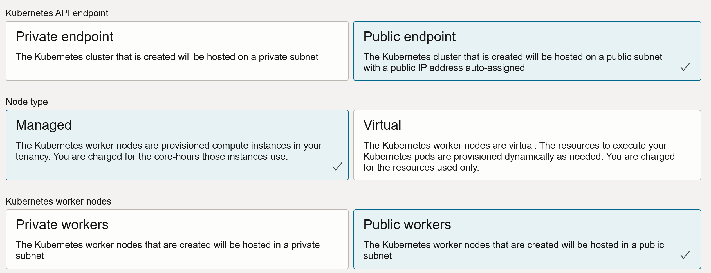
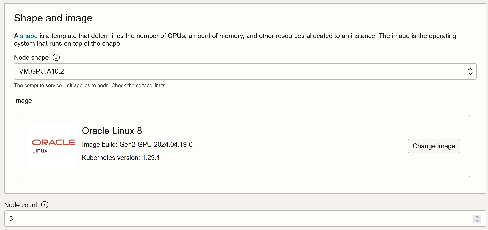
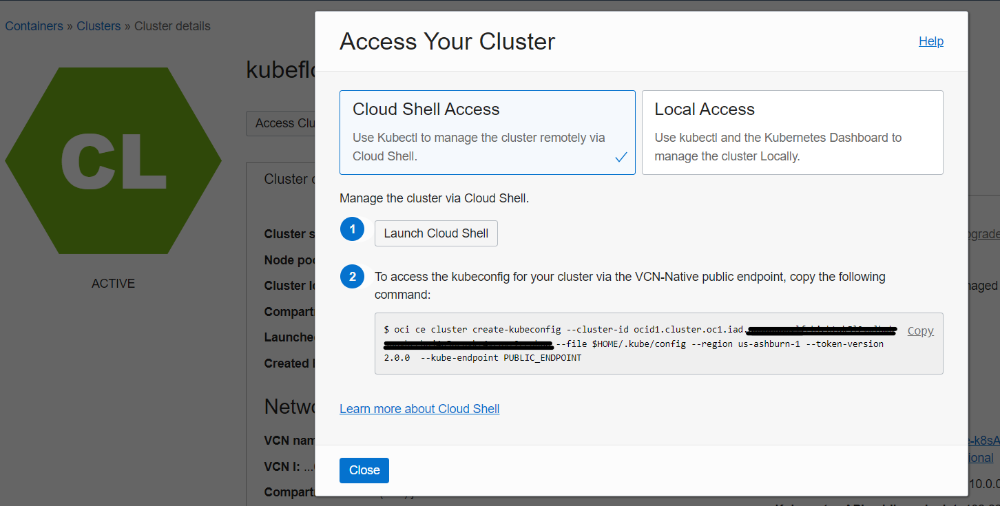
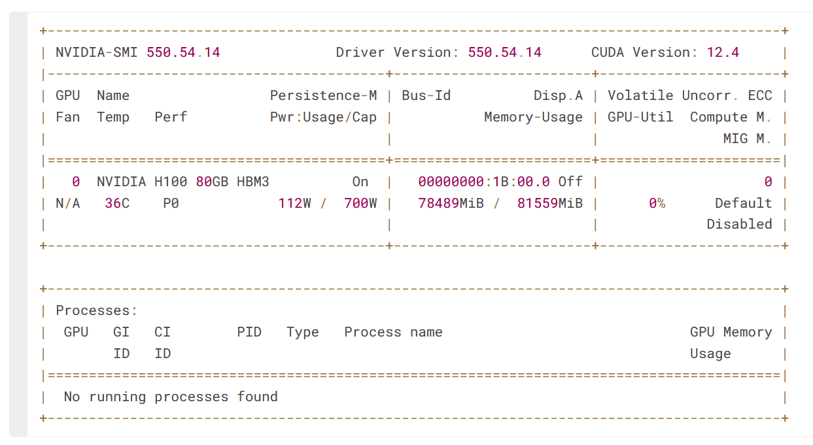
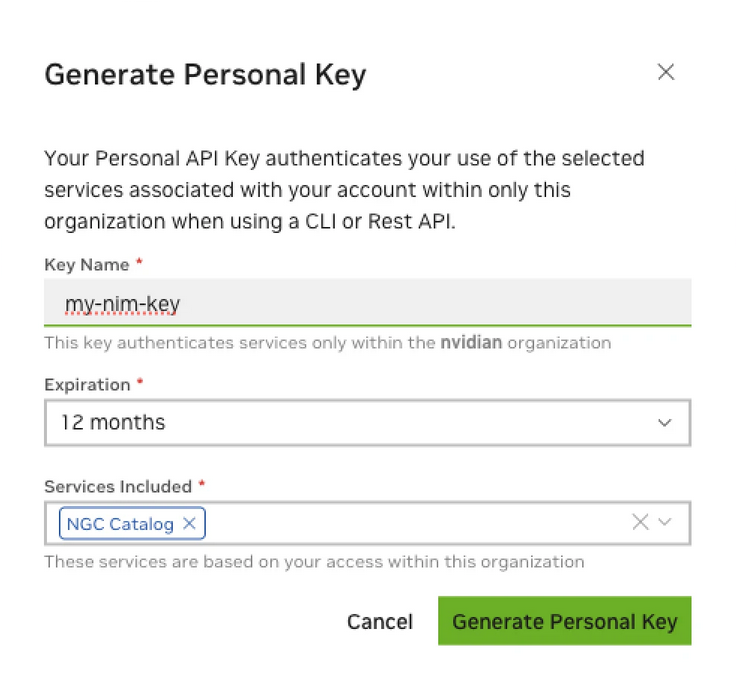

# Getting started with NVIDIA NIM on Oracle Container Engine for Kubernetes (OKE)

[](https://img.shields.io/badge/license-UPL-green)<!--[](https://sonarcloud.io/dashboard?id=oracle-devrel_competency-development-genai)-->

## Introduction

NVIDIA NIM is a set of easy-to-use microservices designed to accelerate the deployment of generative AI models across the cloud, data center, and workstations. NIM’s are categorized by model family and a per model basis. For example, NVIDIA NIM for large language models (LLMs) brings the power of state-of-the-art LLMs to enterprise applications, providing unmatched natural language processing and understanding capabilities.

NIM makes it easy for IT and DevOps teams to self-host large language models (LLMs) in their own managed environments while still providing developers with industry standard APIs that allow them to build powerful copilots, chatbots, and AI assistants that can transform their business. Leveraging NVIDIA’s cutting-edge GPU acceleration and scalable deployment, NIM offers the fastest path to inference with unparalleled performance.

In this solution, we demonstrate how quickly you can get started with NVIDIA NIM (as a Large Language Model inference framework) and Oracle Container Engine for Kubernetes (as the deployment and orchestration system) on OCI.

The application has the following components:

- Oracle Container Engine for Kubernetes (OKE)
- NVIDIA NIM for inferencing LLMs
- Python code to invoke these inference endpoints

This is an illustration of how NIM works whenever we invoke a supported model on the NVIDIA NGC Catalog:



[You can watch the solution's video here.]()

## 0. Prerequisites and docs

### Prerequisites

- An Oracle Cloud Infrastructure (OCI) Account
- An [NVIDIA AI Enterprise](https://www.nvidia.com/en-us/data-center/products/ai-enterprise/) License
- Access to some NVIDIA **A10** or **A100** Tensor Core GPUs on your OCI tenancy
- An Operating System with `x86_64` architecture compatible with the **NVIDIA Container toolkit**. Find [the available list here.](https://docs.nvidia.com/datacenter/cloud-native/container-toolkit/latest/supported-platforms.html)
- CUDA Drivers installed
- Docker installed

### Docs

[NVIDIA NIM Introduction](https://docs.nvidia.com/nim/large-language-models/latest/introduction.html)
[llama-3-8b on NVIDIA NGC Catalog](https://catalog.ngc.nvidia.com/orgs/nim/teams/meta/containers/llama3-8b-instruct)
[Installing the NVIDIA Container Toolkit](https://docs.nvidia.com/datacenter/cloud-native/container-toolkit/latest/install-guide.html#installing-the-nvidia-container-toolkit)
[NIM for LLMs - Prerequisites](https://docs.nvidia.com/nim/large-language-models/latest/getting-started.html#ngc-authentication)

## 1. Set up OKE Instance on OCI

First, let's create an OKE instance in our OCI tenancy. To create an OKE Cluster, we can perform this step through the OCI Console:







> Note you can specify whichever GPU shape available in OCI, each node will be created with the selected shape (you can have multiple OKE nodes in the cluster, so be mindful of resource spending.)

And wait for the creation of the cluster, it'll take around 5 minutes.

> You will be able to access this cluster however you want. It's recommended to use OCI Cloud Shell to access and connect to the cluster, as all OCI configuration is performed automatically. If you still want to use a Compute Instance or your own local machine, you will need to set up authentication to your OCI tenancy. Also, you must have downloaded and installed `OCI CLI version 2.24.0` (or later) and configured it for use. If your version of the OCI CLI is earlier than version `2.24.0`, download and install a newer version from here.

After the cluster has been provisioned, to get access into the OKE cluster, follow these steps:

1. Click Access Cluster on the `Cluster details` page:

    

2. Accept the default Cloud Shell Access and click Copy to copy the `oci ce cluster create-kubeconfig ...` command.

3. To access the cluster, paste the command into your Cloud Shell session and hit Enter.

4. Verify that the `kubectl` is working by using the `get nodes` command:

    ```bash
    kubectl get nodes
    ```

5. Repeat this command multiple times until all nodes show `Ready` in the `STATUS` column:

    When all nodes are `Ready`, your OKE installation has finished successfully.

### Install NVIDIA Container Toolkit

1. Configure the production repository:

    ```bash
    curl -fsSL https://nvidia.github.io/libnvidia-container/gpgkey | sudo gpg --dearmor -o /usr/share/keyrings/nvidia-container-toolkit-keyring.gpg && curl -s -L https://nvidia.github.io/libnvidia-container/stable/deb/nvidia-container-toolkit.list | sed 's#deb https://#deb [signed-by=/usr/share/keyrings/nvidia-container-toolkit-keyring.gpg] https://#g' | sudo tee /etc/apt/sources.list.d/nvidia-container-toolkit.list
    ```

2. Update packages list from repository and install the NVIDIA Container Toolkit required packages:

    ```bash
    sudo apt-get update -y && sudo apt-get install -y nvidia-container-toolkit
    ```

3. Configure Docker's container runtime and restart the Docker daemon:

    ```bash
    sudo nvidia-ctk runtime configure --runtime=docker
    sudo systemctl restart docker
    ```

    > The `nvidia-ctk` command modifies the /etc/docker/daemon.json file on the host. The file is updated so that Docker can use the NVIDIA Container Runtime.

4. To ensure things are working, run the following command:

    ```bash
    docker run --rm --runtime=nvidia --gpus all ubuntu nvidia-smi
    ```

    > This will produce an output for your own system, where you can confirm CUDA driver version, and available GPUs:

    

5. Now, we need to authenticate against **NVIDIA NGC**, a portal of services that allows us to download and use LLMs and other types of AI solutions (basically, the LLM model catalog and much more). An NGC API key is required to access NGC resources and a key can be generated [in this URL.](https://org.ngc.nvidia.com/setup/personal-keys):

    

    > It is required that permission `NGC Catalog` is enabled on the key.

6. Let's make note of this API as we will use it in the next step, and put it into our OCI Cloud Shell, in order to automatically authenticate with NVIDIA's Container Registry (`nvcr`):

    ```bash
    export NGC_API_KEY=<YOUR_API_KEY>
    ```

7. Authenticate against `nvcr` by running the following command (make sure your environment variable is set on the previous step):

    ```bash
    echo "$NGC_API_KEY" | docker login nvcr.io --username '$oauthtoken' --password-stdin
    ```

Now that our OKE environment has been created, and we're correctly authenticated on NVIDIA's Container Registry, we can deploy the inference server.

## 2. Deploy the inference server

1. Deploy the inference server using the default configuration with the following commands:

    ```bash
    git clone https://github.com/jasperan/nvidia-nim-oke.git
    # now, go for the file with the Helm configuration .yaml file:
    cd nvidia-nim-oke/helm/
    #helm install nim . -f values.yaml --debug

    helm install triton-inference-server --set image.imageName="nvcr.io/nvidia/tritonserver:latest"
    ```

    > You can check the status of the installation with `helm status <name>` and delete the Helm chart with `helm delete <name>`.

2. Use `kubectl` to see the status of this Helm deployment, and wait until the inference server pods are running (the first pull might take a few minutes). Once the container is created, loading the model also takes a few minutes. You can monitor the pod with these commands:

    ```bash
    kubectl describe pods <POD_NAME>
    kubectl logs <POD_NAME>
    ```

3. Once the setup is complete, your container should be running:

    ```bash
    $ kubectl get pods
    NAME                                               READY   STATUS    RESTARTS   AGE
    your_pod_name                                      1/1     Running   0          2m21s
    ```bash


-------
--------
-------
-------
--------
-------
-------
--------
-------

2. If you don't have a virtual environment, create a new one:

    ```bash
    python3 -m venv .demo
    ```

3. Activate the virtual environment you just created:

    ```bash
    source .demo/bin/activate
    ```

4. Install Python requirements into the environment:

    ```bash
    pip install -r requirements.txt
    ```

5. Run the app:

  ```bash
  (.demo) %  streamlit run jobposting.py
  ```

This should spin up the application and the following message will be displayed in the terminal:

```bash
  > You can now view your Streamlit app in your browser.

  Local URL: http://localhost:8501
  Network URL: http://10.126.180.172:8501
```

> You can access the application in your browser, using either localhost for deploying locally or hosting it in an OCI Compute Instance and exposing its public IP address to the Internet.

## Contributing

<!-- If your project has specific contribution requirements, update the
    CONTRIBUTING.md file to ensure those requirements are clearly explained. -->

This project welcomes contributions from the community. Before submitting a pull
request, please [review our contribution guide](./CONTRIBUTING.md).

## Security

Please consult the [security guide](./SECURITY.md) for our responsible security
vulnerability disclosure process.

## License

Copyright (c) 2024 Oracle and/or its affiliates.

Licensed under the Universal Permissive License (UPL), Version 1.0.

See [LICENSE](LICENSE.txt) for more details.

ORACLE AND ITS AFFILIATES DO NOT PROVIDE ANY WARRANTY WHATSOEVER, EXPRESS OR IMPLIED, FOR ANY SOFTWARE, MATERIAL OR CONTENT OF ANY KIND CONTAINED OR PRODUCED WITHIN THIS REPOSITORY, AND IN PARTICULAR SPECIFICALLY DISCLAIM ANY AND ALL IMPLIED WARRANTIES OF TITLE, NON-INFRINGEMENT, MERCHANTABILITY, AND FITNESS FOR A PARTICULAR PURPOSE.  FURTHERMORE, ORACLE AND ITS AFFILIATES DO NOT REPRESENT THAT ANY CUSTOMARY SECURITY REVIEW HAS BEEN PERFORMED WITH RESPECT TO ANY SOFTWARE, MATERIAL OR CONTENT CONTAINED OR PRODUCED WITHIN THIS REPOSITORY. IN ADDITION, AND WITHOUT LIMITING THE FOREGOING, THIRD PARTIES MAY HAVE POSTED SOFTWARE, MATERIAL OR CONTENT TO THIS REPOSITORY WITHOUT ANY REVIEW. USE AT YOUR OWN RISK.
